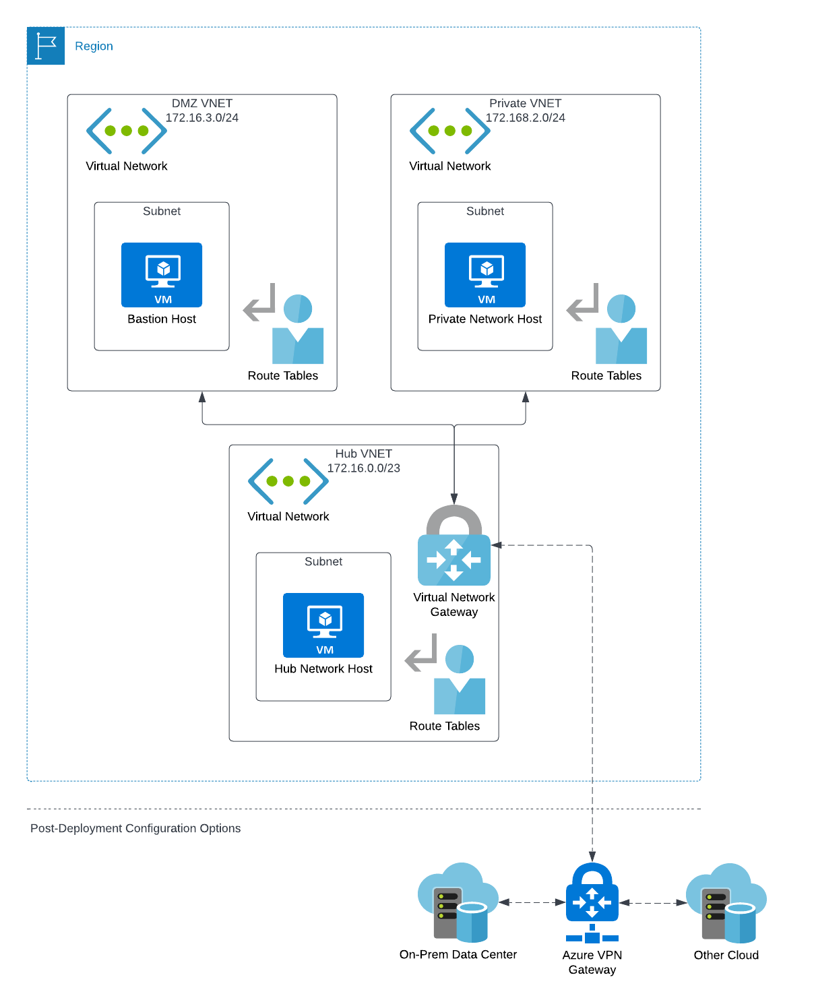

# Transit Network Deployment Role

This Ansible role contains repeatable automation for a hub-and-spoke VNET peering model that can help establish template infrastructure configurations that may be used for starting an Azure networking infrastructure strategy or to create demonstrations for network peering scenarios.

## Create Transit Network

This operation will create the resources necessary for a transit network model with three VNETs.

1. One acting as a public internet-facing DMZ where bastion servers and other internet resources could exist.
2. Another that acts as an entirely private network with no internet access.
3. A third hub where a Virtual Network Gateway resides that can route traffic between the networks.  

These networks are configured with routing rules that allow traffic between the VNETs and their subnets through the Virtual Network Gateway.  Once deployed, you can SSH in to the bastion host in order to can access to the host on the private network.

### Variables

The following variables are used during deployment and can be configured as extra vars at deploy time if you require something other than the defaults.

#### Required

The `ansible_ssh_pub_key` file is set as the public access key on all VMs deployed in this role.

```yaml
---
region: eastus
resource_group: rg-transit-routing-demo
ansible_ssh_pub_key: ~/.ssh/id_rsa_azure_demo.pub
```

#### Optional (Networking Configuration)

```yaml
---
hub_vnet_name: hub-vnet
hub_vnet_cidr: "172.16.0.0/23"
hub_subnet_name: hub-subnet
hub_subnet_cidr: "172.16.0.0/24"
route_table_name: "hub-and-spoke-route-table"
spoke1_vnet_name: spoke-1-vnet
spoke1_vnet_cidr: "172.16.2.0/24"
spoke1_subnet_name: spoke-1-subnet
spoke1_subnet_cidr: "172.16.2.0/24"
spoke2_vnet_name: spoke-2-vnet
spoke2_vnet_cidr: "172.16.3.0/24"
spoke2_subnet_name: spoke-2-subnet
spoke2_subnet_cidr: "172.16.3.0/24"
ssh_security_group_name: ssh-security-group
virtual_gw_name: hub-gateway
virtual_gw_sku: Basic
virtual_gw_subnet_cidr: "172.16.1.0/26"
virtual_gw_vpn_type: route_based
vm_disk_type: Standard_LRS
vm_max_price: -1
vm_priority: Spot
vm_sku: "9_1"
vm_size: Standard_A1_v2
vm_username: azureuser
```

#### Optional (VM Configuration)

The following sets the local private SSH key that will be used to authenticate to the DMZ VM once it is created.  This is used to then configure that VM to be able to access the private VMs and act as a bastion server.  

```yaml
---
dmz_ansible_ssh_private_key_file: ~/.ssh/id_rsa_azure_demo # private key for `ansible_ssh_pub_key` set in earlier steps.
```

### Infrastructure

The following Azure infrastructure resources are created during this deployment.  The delete operation attempts to remove the entire resource group, therefor removing all of the resources created.

### Architecture Diagram



Resources below the dotted line demonstrate how you may connect other resources to the architecture through Virtual Network Gateway connectivity.
